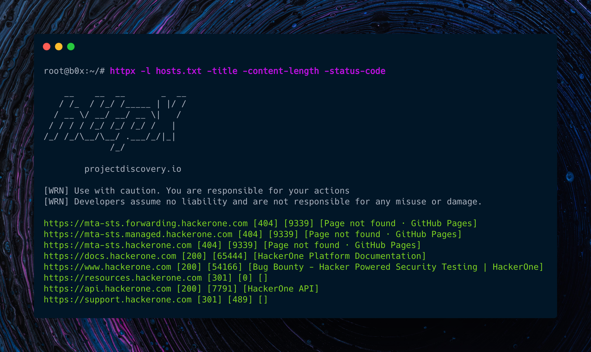

<h1 align="left">
  </a>
  <br>
</h1>

[](https://opensource.org/licenses/MIT)
[](https://goreportcard.com/report/github.com/projectdiscovery/httpx)
[](https://github.com/projectdiscovery/httpx/issues)
[](https://github.com/projectdiscovery/httpx/releases)
[](https://twitter.com/pdiscoveryio)
[](https://hub.docker.com/r/projectdiscovery/httpx)
[](https://discord.gg/KECAGdH)

httpx is a fast and multi-purpose HTTP toolkit allow to run multiple probers using [retryablehttp](https://github.com/projectdiscovery/retryablehttp-go) library, it is designed to maintain the result reliability with increased threads.

# Resources
- [Resources](#resources)
- [Features](#features)
- [Usage](#usage)
- [Installation Instructions](#installation-instructions)
    - [From Binary](#from-binary)
    - [From Source](#from-source)
    - [From Github](#from-github)
- [Running httpx with stdin](#running-httpx-with-stdin)
- [Running httpx with file input](#running-httpx-with-file-input)
- [Running httpx with CIDR input](#running-httpx-with-cidr-input)
- [Running httpX with subfinder](#running-httpx-with-subfinder)
- [Todo](#todo)
- [Thanks](#thanks)

 # Features

<h1 align="left">
  </a>
  <br>
</h1>

 - Simple and modular code base making it easy to contribute.
 - Fast And fully configurable flags to probe mutiple elements.
 - Supports multiple HTTP based probings.
 - Smart auto fallback from https to http as default. 
 - Supports hosts, URLs and CIDR as input.
 - Handles edge cases doing retries, backoffs etc for handling WAFs.

 ### Supported **httpx** probes:- 

| Probes             | Status  |
|--------------------|---------|
| URL                | ✔       |
| Title              | ✔       |
| Status Code        | ✔       |
| Content Length     | ✔       |
| TLS Certificate    | ✔       |
| CSP Header         | ✔       |
| HTTP2              | ✔       |
| HTTP 1.1 Pipeline  | ✔       |
| Virtual host       | ✔       |
| Location Header    | ✔       |
| Web Server         | ✔       |
| Web Socket         | ✔       |
| Path               | ✔       |
| Ports              | ✔       |
| Request method     | ✔       |
| Ip                 | ✔       |
| CNAME              | ✔       |
| CDN                | ✔       |


# Installation Instructions


### From Binary

The installation is easy. You can download the pre-built binaries for your platform from the [Releases](https://github.com/projectdiscovery/httpx/releases/) page. Extract them using tar, move it to your `$PATH`and you're ready to go.

```sh
Download latest binary from https://github.com/projectdiscovery/httpx/releases

▶ tar -xvf httpx-linux-amd64.tar
▶ mv httpx-linux-amd64 /usr/local/bin/httpx
▶ httpx -h
```

### From Source

httpx requires **go1.14+** to install successfully. Run the following command to get the repo - 

```sh
▶ GO111MODULE=auto go get -u -v github.com/projectdiscovery/httpx/cmd/httpx
```

### From Github

```sh
▶ git clone https://github.com/projectdiscovery/httpx.git; cd httpx/cmd/httpx; go build; mv httpx /usr/local/bin/; httpx -h
```

# Usage

```sh
httpx -h
```

This will display help for the tool. Here are all the switches it supports.

| Flag                    | Description                                             | Example                                            |
|-------------------------|---------------------------------------------------------|----------------------------------------------------|
| -H                      | Custom Header input                                     | httpx -H 'x-bug-bounty: hacker'                    |
| -follow-redirects       | Follow URL redirects (default false)                    | httpx -follow-redirects                            |
| -follow-host-redirects  | Follow URL redirects only on same host(default false)   | httpx -follow-host-redirects                       |
| -http-proxy             | URL of the proxy server                                 | httpx -http-proxy hxxp://proxy-host:80             |
| -l                      | File containing HOST/URLs/CIDR to process               | httpx -l hosts.txt                                 |
| -no-color               | Disable colors in the output.                           | httpx -no-color                                    |
| -o                      | File to save output result (optional)                   | httpx -o output.txt                                |
| -json                   | Prints all the probes in JSON format (default false)    | httpx -json                                        |
| -vhost                  | Probes to detect vhost from list of subdomains          | httpx -vhost                                       |
| -threads                | Number of threads (default 50)                          | httpx -threads 100                                 |
| -http2                  | HTTP2 probing                                           | httpx -http2                                       |
| -pipeline               | HTTP1.1 Pipeline probing                                | httpx -pipeline                                    |
| -ports                  | Ports ranges to probe (nmap syntax: eg 1,2-10,11)       | httpx -ports 80,443,100-200                        |
| -title                  | Prints title of page if available                       | httpx -title                                       |
| -path                   | Request path/file                                       | httpx -path /api                                   |
| -content-length         | Prints content length in the output                     | httpx -content-length                              |
| -ml                     | Match content length in the output                      | httpx -content-length -ml 125                      |
| -fl                     | Filter content length in the output                     | httpx -content-length -fl 0,43                     |
| -status-code            | Prints status code in the output                        | httpx -status-code                                 |
| -mc                     | Match status code in the output                         | httpx -status-code -mc 200,302                     |
| -fc                     | Filter status code in the output                        | httpx -status-code -fc 404,500                     |
| -tls-probe              | Send HTTP probes on the extracted TLS domains           | httpx -tls-probe                                   |
| -content-type           | Prints content-type                                     | httpx -content-type                                |
| -location               | Prints location header                                  | httpx -location                                    |
| -csp-probe              | Send HTTP probes on the extracted CSP domains           | httpx -csp-probe                                   |
| -web-server             | Prints running web sever if available                   | httpx -web-server                                  |
| -sr                     | Store responses to file (default false)                 | httpx -store-response                              |
| -srd                    | Directory to store response (default output)            | httpx -store-response-dir output                   |
| -unsafe                 | Send raw requests skipping golang normalization         | httpx -unsafe                                      | 
| -request                 | File containing raw request to process                 | httpx -request                                     | 
| -retries                | Number of retries                                       | httpx -retries                                     |
| -silent                 | Prints only results in the output                       | httpx -silent                                      |
| -timeout                | Timeout in seconds (default 5)                          | httpx -timeout 10                                  |
| -verbose                | Verbose Mode                                            | httpx -verbose                                     |
| -version                | Prints current version of the httpx                     | httpx -version                                     |
| -x                      | Request Method (default 'GET')                          | httpx -x HEAD                                      |
| -method                 | Output requested method                                 | httpx -method                                      |
| -response-in-json       | Include response in stdout (only works with -json)      | httpx -response-in-json                            |
| -websocket              | Prints if a websocket is exposed                        | httpx -websocket                                   |
| -ip                     | Prints the host IP                                      | httpx -ip                                          |
| -cname                  | Prints the cname record if available                    | httpx -cname                                       |
| -cdn                    | Check if domain's ip belongs to known CDN               | httpx -cdn                                         |
| -filter-string          | Filter results based on filtered string                 | httpx -filter-string XXX                           |
| -match-string           | Filter results based on matched string                  | httpx -match-string XXX                            |
| -filter-regex           | Filter results based on filtered regex                  | httpx -filter-regex XXX                            |
| -match-regex            | Filter results based on matched regex                   | httpx -match-regex XXX                             |


### Running httpx with stdin  

This will run the tool against all the hosts and subdomains in `hosts.txt` and returns URLs running HTTP webserver. 

```sh
▶ cat hosts.txt | httpx 

    __    __  __       _  __
   / /_  / /_/ /_____ | |/ /
  / __ \/ __/ __/ __ \|   / 
 / / / / /_/ /_/ /_/ /   |  
/_/ /_/\__/\__/ .___/_/|_|   v1.0  
             /_/            

		projectdiscovery.io

[WRN] Use with caution. You are responsible for your actions
[WRN] Developers assume no liability and are not responsible for any misuse or damage.

https://mta-sts.managed.hackerone.com
https://mta-sts.hackerone.com
https://mta-sts.forwarding.hackerone.com
https://docs.hackerone.com
https://www.hackerone.com
https://resources.hackerone.com
https://api.hackerone.com
https://support.hackerone.com
```

### Running httpx with file input  

This will run the tool against all the hosts and subdomains in `hosts.txt` and returns URLs running HTTP webserver.

```sh
▶ httpx -l hosts.txt -silent

https://docs.hackerone.com
https://mta-sts.hackerone.com
https://mta-sts.managed.hackerone.com
https://mta-sts.forwarding.hackerone.com
https://www.hackerone.com
https://resources.hackerone.com
https://api.hackerone.com
https://support.hackerone.com
```

### Running httpx with CIDR input   

```sh
▶ echo 173.0.84.0/24 | httpx -silent

https://173.0.84.29
https://173.0.84.43
https://173.0.84.31
https://173.0.84.44
https://173.0.84.12
https://173.0.84.4
https://173.0.84.36
https://173.0.84.45
https://173.0.84.14
https://173.0.84.25
https://173.0.84.46
https://173.0.84.24
https://173.0.84.32
https://173.0.84.9
https://173.0.84.13
https://173.0.84.6
https://173.0.84.16
https://173.0.84.34
```


### Running httpX with subfinder


```sh
▶ subfinder -d hackerone.com -silent | httpx -title -content-length -status-code -silent

https://mta-sts.forwarding.hackerone.com [404] [9339] [Page not found · GitHub Pages]
https://mta-sts.hackerone.com [404] [9339] [Page not found · GitHub Pages]
https://mta-sts.managed.hackerone.com [404] [9339] [Page not found · GitHub Pages]
https://docs.hackerone.com [200] [65444] [HackerOne Platform Documentation]
https://www.hackerone.com [200] [54166] [Bug Bounty - Hacker Powered Security Testing | HackerOne]
https://support.hackerone.com [301] [489] []
https://api.hackerone.com [200] [7791] [HackerOne API]
https://hackerone.com [301] [92] []
https://resources.hackerone.com [301] [0] []
```

## Todo

- [ ] Adding support to probe [http smuggling](https://portswigger.net/web-security/request-smuggling)


# Thanks

httpX is made with 🖤 by the [projectdiscovery](https://projectdiscovery.io) team. Community contributions have made the project what it is. See the **[Thanks.md](https://github.com/projectdiscovery/httpx/blob/master/THANKS.md)** file for more details. Do also check out these similar awesome projects that may fit in your workflow:

Probing feature is inspired by [@tomnomnom/httprobe](https://github.com/tomnomnom/httprobe) work :heart:
